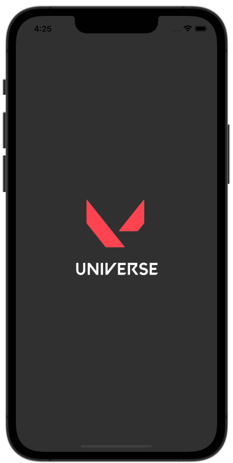
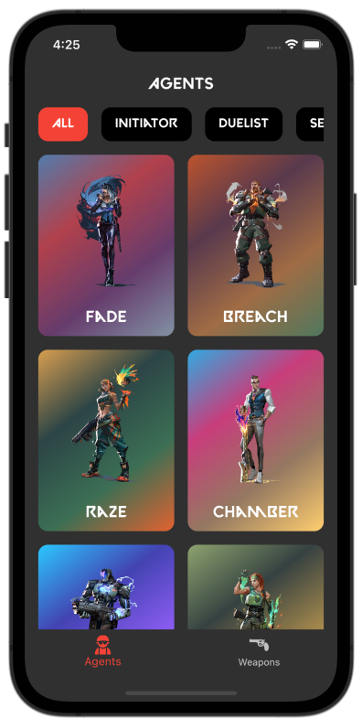
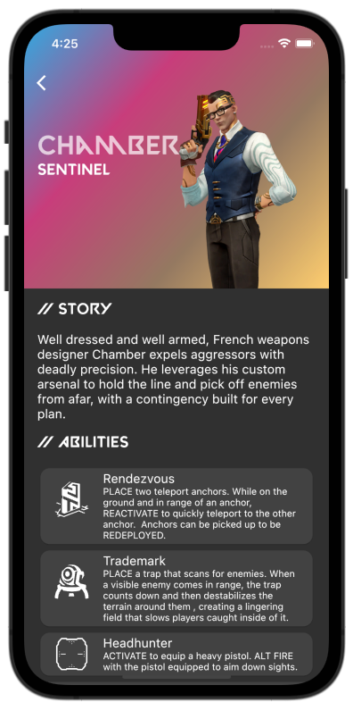
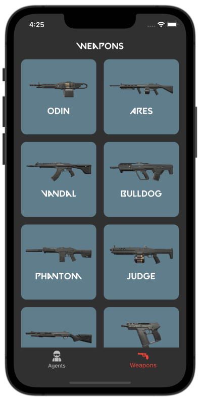
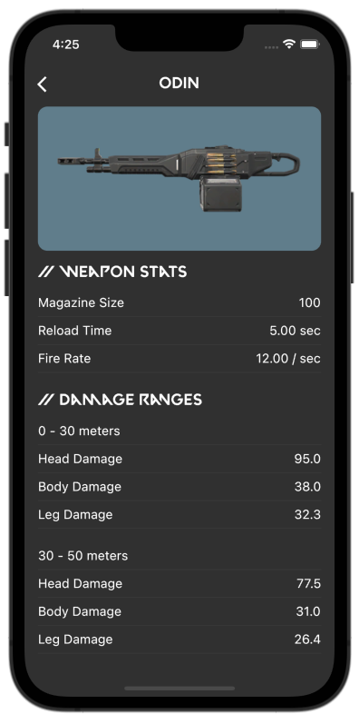

  <h1 align="center">Valorant Universe</h1>
  

    Valorant Universe is an application that introduces agents and weapons from Valorant game using Valorant-API. 
  

## Built With

- [Flutter](https://flutter.dev/)
- [Dart](https://dart.dev/)
- [Valorant-API](https://dash.valorant-api.com/)

## Preview

    
    
    
    
    

## Architecture

This app is developed with [MVVM](https://en.wikipedia.org/wiki/Model%E2%80%93view%E2%80%93viewmodel) pattern.

## Packages

- State management
  - [MobX](https://pub.dev/packages/mobx)
  - [Flutter Mobx](https://pub.dev/packages/flutter_mobx)
- Cache
  - [Cached Network Image](https://pub.dev/packages/cached_network_image)
- Network
  - [dio](https://pub.dev/packages/dio)
  - [PrettyDioLogger](https://pub.dev/packages/pretty_dio_logger)
- Navigation
  - [GoRouter](https://pub.dev/packages/go_router)
- Localization
  - [EasyLocalization](https://pub.dev/packages/easy_localization)
- Google
  - [Json Annotation](https://pub.dev/packages/json_annotation)
  - [Json Serializable](https://pub.dev/packages/json_serializable)
- Code Generation
  - [MobX Codegen](https://pub.dev/packages/mobx_codegen)
  - [Build Runner](https://pub.dev/packages/build_runner)

## Project Structure

- Core folder represents the services, classes that can be used in any other project.
- Features folder represents the feature set of the app. Each feature contains service, model, view, viewmodel subfolders.
- Product folder contains files specific to this project.

<pre>

├── assets
│   ├── fonts
│   ├── icons
│   └── translations
├── lib
│   ├── core
│   │   ├── enum
│   │   ├── extension
│   │   └── service
│   │       ├── network
│   │       └── navigation
│   ├── features
│   │   ├── agent_detail
│   │   ├── agents
│   │   ├── navbar
│   │   ├── weapon_detail
│   │   └── weapons
│   ├── product
│   │   ├── constants
│   │   ├── icons
│   │   ├── init
│   │   ├── lang
│   │   ├── router
│   │   ├── theme
│   │   └── widget
│   └── main.dart
├── script
├── test
│   └── service
└── pubspec.yaml
</pre>

## License

<pre>

MIT License

Copyright (c) 2022 Cem Avcı

Permission is hereby granted, free of charge, to any person obtaining a copy
of this software and associated documentation files (the "Software"), to deal
in the Software without restriction, including without limitation the rights
to use, copy, modify, merge, publish, distribute, sublicense, and/or sell
copies of the Software, and to permit persons to whom the Software is
furnished to do so, subject to the following conditions:

The above copyright notice and this permission notice shall be included in all
copies or substantial portions of the Software.

THE SOFTWARE IS PROVIDED "AS IS", WITHOUT WARRANTY OF ANY KIND, EXPRESS OR
IMPLIED, INCLUDING BUT NOT LIMITED TO THE WARRANTIES OF MERCHANTABILITY,
FITNESS FOR A PARTICULAR PURPOSE AND NONINFRINGEMENT. IN NO EVENT SHALL THE
AUTHORS OR COPYRIGHT HOLDERS BE LIABLE FOR ANY CLAIM, DAMAGES OR OTHER
LIABILITY, WHETHER IN AN ACTION OF CONTRACT, TORT OR OTHERWISE, ARISING FROM,
OUT OF OR IN CONNECTION WITH THE SOFTWARE OR THE USE OR OTHER DEALINGS IN THE
SOFTWARE.

</pre>

